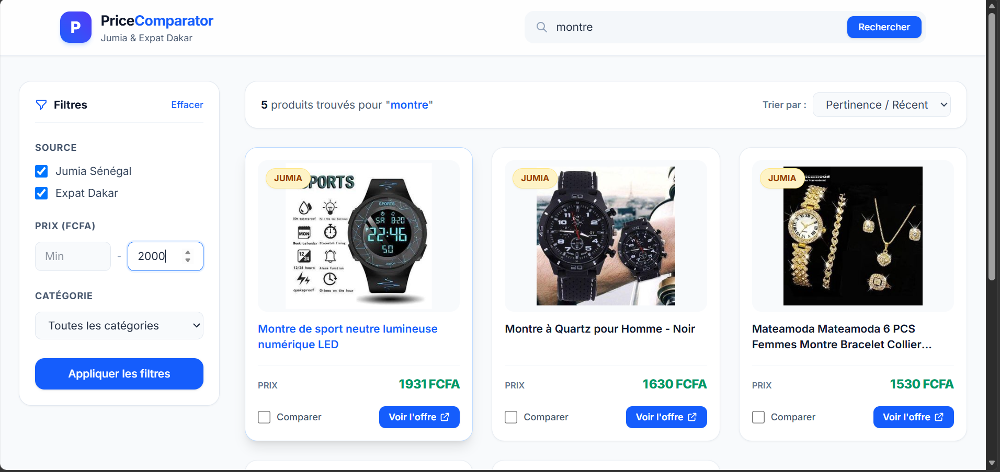

<div align="center">

# 🛒 Price Comparator (Jumia vs Expat Dakar)

**Plateforme web full-stack d'extraction, d'agrégation et de comparaison de prix e-commerce au Sénégal.**

[](https://www.python.org/)
[](https://fastapi.tiangolo.com/)
[](https://react.dev/)
[](https://tailwindcss.com/)
[](https://www.postgresql.org/)
[](https://www.docker.com/)

</div>

---
## 📸 Screenshot
<p align="center">
  
</p>

---

## 📌 À propos du projet

**Price Comparator** est un outil conçu pour automatiser la recherche et la veille tarifaire en ligne. L'application extrait dynamiquement les offres de produits depuis **Jumia Sénégal** et **Expat Dakar**, agrège les données via une API REST sous **FastAPI**, et présente les résultats comparatifs côte à côte sur une interface réactive développée en **React** et stylisée avec **Tailwind CSS**.

---

## ✨ Fonctionnalités Principales

- 🔍 **Scraping Multi-Sources :** Extraction automatique des titres, prix, images et URLs directes depuis Jumia et Expat Dakar.
- ⚡ **API REST Performante :** Backend sous FastAPI avec typage strict (Pydantic) et validation des données.
- ⚛️ **Interface React & Tailwind CSS :** Comparaison instantanée, design moderne responsive, tri par prix et filtrage par plateforme.
- 🐘 **Stockage Robuste (PostgreSQL) :** Gestion persistance des données et exploitation des capacités `JSONB` et de la recherche textuelle avancée.
- 🐳 **Conteneurisation (Docker Compose) :** Orchestration clé en main de la base de données PostgreSQL et du serveur de cache Redis.

---

## 📂 Architecture du Projet

```text
price_comparator/
├── backend/                  # 🐍 Backend Python (API REST & Web Scraping)
│   ├── app/
│   │   ├── api/              # Endpoints & Routes FastAPI
│   │   ├── scrapers/         # Scripts de scraping (Jumia, ExpatDakar)
│   │   ├── db/               # Configuration SQLAlchemy & Modèles PostgreSQL
│   │   └── main.py           # Point d'entrée de l'application FastAPI
│   └── requirements.txt      # Dépendances Python
│
├── frontend/                 # ⚛️ Application Frontend React (Vite & Tailwind CSS)
│   ├── src/
│   │   ├── components/       # Composants réutilisables (SearchBar, ProductCard, etc.)
│   │   ├── services/         # Client API HTTP
│   │   └── App.jsx           # Composant principal
│   ├── tailwind.config.js    # Configuration Tailwind CSS
│   └── package.json          # Dépendances JavaScript
│
├── docker-compose.yml        # Orchestration PostgreSQL & Redis
└── README.md